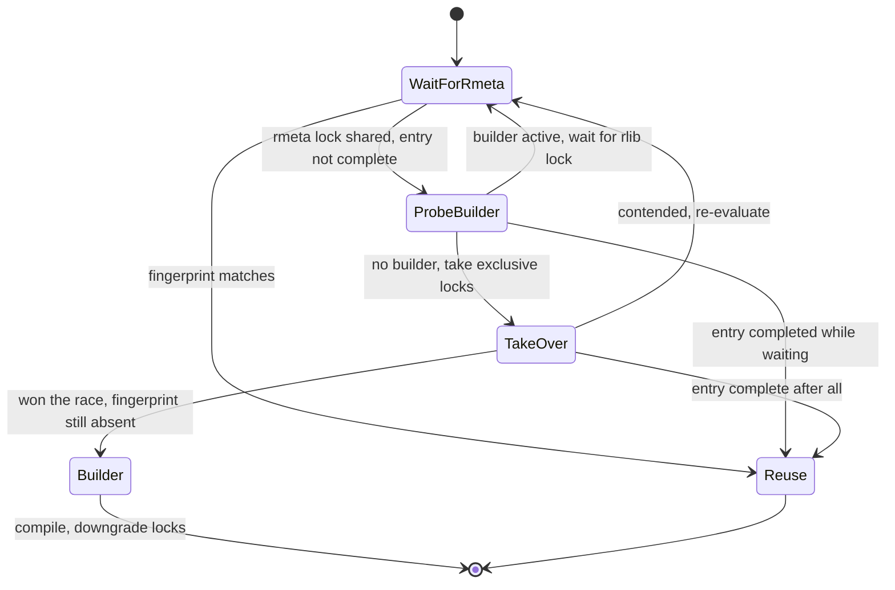

# Cross-workspace build cache

Cargo compiles eligible dependencies once into `$CARGO_HOME/build-cache` and reuses the artifacts in every workspace, including across concurrent cargo processes. A dependency that used to rebuild in each workspace now compiles one time per identity, and a second workspace's cold build skips rustc for it entirely.

The cache is part of the new build-dir layout work and is enabled whenever `-Zbuild-dir-new-layout` is active. If `$CARGO_HOME` is read-only, the cache disables itself for the invocation and everything falls back to the workspace build directory.

## High level design

### What gets cached

A unit is cacheable when it is not workspace-local, has no build script, and is not a bin, doc, test, or artifact unit. A unit that depends on a path-sourced package (a `[patch]` target, a `[replace]`, or a directory source) is also excluded: path inputs are mtime-tracked workspace state, and the cache is keyed by content only. Eligibility is computed once from the unit graph in `CompilationFiles::is_cacheable`.

The cache key is the unit hash plus the crate metadata hash. The unit hash deliberately excludes the git revision, so `compute_metadata` mixes the git `precise` in; each revision maps to its own entry and entries are truly immutable.

### Where entries live

```text
$CARGO_HOME/build-cache/
  $pkgname/
    $hash/
      out/          rustc artifacts
      fingerprint/  fingerprint, dep-info, message cache
      incremental/  reserved (never used; incremental is off for non-local packages)
      .rmeta.lock   state lock: metadata availability
      .rlib.lock    state lock: full completion
```

### Freshness

Cached units use the normal fingerprint comparison: the stored fingerprint must match the freshly computed one, and the unit's own outputs must exist. The stored fingerprint is normalized so it is stable across workspace cleans (see implementation details). Nothing rebuilds an entry unless identity changes or the entry is incomplete.

### Concurrency

Each entry carries two flock-backed state locks. A job for a dirty cacheable unit runs a small protocol (`CacheCoordination::coordinate`) and becomes either the builder (compiles the unit) or a waiter (observes and reuses). Exactly one process compiles a given unit even when several workspaces race on a cold cache; waiters can start pipelined compilation of their own dependents against the metadata while the builder is still codegen-ing.



Crash recovery falls out of the same protocol. A builder killed mid-compile releases its locks and leaves no fingerprint, so the next job through the state machine takes over and finishes the unit.

## Modules affected

- `src/compiler/cache.rs` (new). `CacheCoordination`, the per-unit builder/waiter protocol, and the completion check for cache entries.
- `src/compiler/locking.rs`. `LockManager` counts acquisitions per key and records the mode, converts shared to exclusive in one reviewed place (`exchange_for_exclusive`), asserts protocol invariants in debug builds (`assert_locked`), and reports held locks (`active_locks`).
- `src/compiler/fingerprint/mod.rs`. Fingerprint normalization for cacheable units, pinned dependency rmeta checksums, lazy completion hashing, and the eligibility-aware filesystem check.
- `src/compiler/build_runner/compilation_files.rs`. Path routing: deps, output, fingerprint, incremental, and lock paths switch on cacheability. Owns `is_cacheable`.
- `src/compiler/layout.rs`. The `build-cache` layout under `$CARGO_HOME` and the writability probe that disables the cache when the home is read-only.
- `src/compiler/unit.rs`. `Unit::is_cacheable`, the per-unit eligibility predicate.
- `src/compiler/mod.rs`. Job wiring for the coordination object, the `build cache: ... is fresh (hit ...)` diagnostics, and the `-Zbuild-analysis` lock summary.
- `src/compiler/job_queue/`. Idempotent `rmeta_produced` (a waiter can signal it twice on the crash path), and a side-effect-free cache-hit probe on `Job` so the queue does not print `Compiling` for a unit it will only read from the cache.
- `src/util/flock.rs`. flock primitives used by the state locks.
- `tests/testsuite/build_cache.rs` (new). 12 integration tests: reuse across workspaces, concurrent builders, crash takeover, git rev bumps, exclusions, and output assertions.

## Implementation details

### The two-lock protocol

`.rmeta.lock` is exclusive while compiling and downgrades to shared as soon as rustc reports the `.rmeta` artifact. `.rlib.lock` downgrades to shared only after all artifacts are written and the fingerprint is persisted. Acquiring a lock shared therefore proves something: shared `.rmeta.lock` means the metadata is readable, shared `.rlib.lock` means the unit is complete.

Two invariants keep the multi-lock protocol deadlock free. Every acquisition follows the same order (`.rmeta.lock` before `.rlib.lock`), and contenders release their shared locks before attempting the exclusive conversion, because a blocking shared-to-exclusive flock drops the old lock while it waits.

Locks stay held (shared) until the process exits, matching the existing fine-grain-locking policy. `LockManager` counts acquisitions per key, so a downgraded lock is released only when it has been unlocked as many times as it was acquired. In debug builds, `assert_locked` checks the protocol's load-bearing conditions on every test-suite run: the early pipelining signal fires under shared `.rmeta.lock`, downgrades happen only in builder role, and the fingerprint exists before `.rlib.lock` goes shared.

### Fingerprint normalization

A stored cache fingerprint must match a freshly computed one even after `cargo clean` or a rebuild of a non-cacheable dependency. Three mechanisms make that work:

1. Build-script and path dependencies in the fingerprint tree are replaced, recursively, with a content-based form: package fingerprint, `-C metadata`, and the checksum of the dependency's rmeta bytes. The rmeta checksum matters because a dependency's rmeta embeds workspace-absolute paths (such as a build script's `OUT_DIR`), so the same unit built in two workspaces has different crate identity at the artifact level. Pinning the bytes makes the entry rebuild against local artifacts instead of failing at link time with `E0460` or `E0463`.
2. Checksums are refreshed at write time (a cold build prepares the fingerprint before its dependencies exist) and again lazily at completion-check time, when a dirty unit's job runs and its dependencies have been built.
3. The filesystem check for cacheable units ignores dependency mtimes entirely. Cache artifacts are written once and never touched again, so mtime chains against them carry no signal; content matching is the authority. Cacheable units must not have their stored fingerprint truncated when they are planned as dirty, since that file lives inside the cache entry and wiping it would destroy a valid entry.

### Observability

Worker threads acquire cache locks silently (the closures are `'static` and cannot print), so the build restores visibility in two places. Every reuse prints `build cache: `pkg` target is fresh (hit $CARGO_HOME/build-cache/...)`. With `-Zbuild-analysis`, the build ends with a summary of every lock still held, for example:

```text
    Held 1x shared .../build-cache/dep1/<hash>/.rlib.lock
         1x shared .../.rmeta.lock
```

### Known limitations

- No garbage collection. Git revision bumps and rustc upgrades accumulate entries; old ones are orphaned, never deleted.
- If a builder crashes after the metadata is ready but before completion, a waiter's takeover rewrites the `.rmeta` that other waiters may already be reading. The rewrite is byte-identical in practice and the window is narrow, so this is accepted for now.
- Entries written by a buggy intermediate cargo binary can poison the cache (the fingerprint is content-correct but the artifact references are not). The remedy is a one-time wipe of `~/.cargo/build-cache`; correct cargo versions never produce this.
